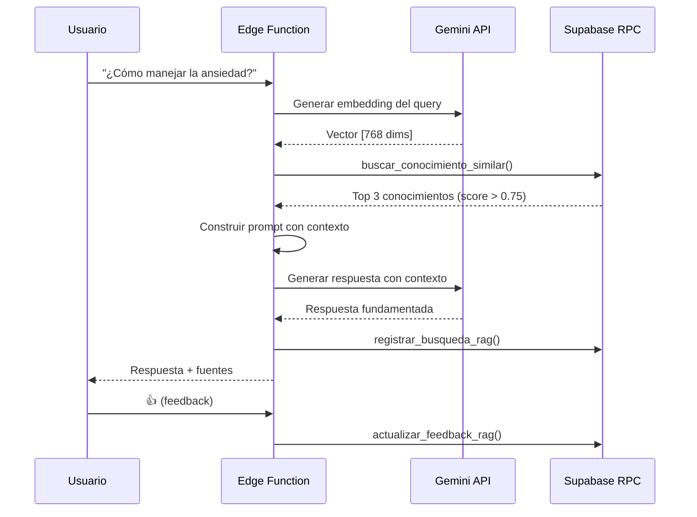

# Sistema RAG con pgvector para Base de Conocimiento Clínico

## Tabla de Contenidos

1. [Introducción](#introducción)
2. [Arquitectura](#arquitectura)
3. [Estructura de Datos](#estructura-de-datos)
4. [Funciones RPC](#funciones-rpc)
5. [Seguridad (RLS)](#seguridad-rls)
6. [Flujo de Uso](#flujo-de-uso)
7. [Integración con Edge Functions](#integración-con-edge-functions)
8. [Expansión de Conocimiento](#expansión-de-conocimiento)
9. [Análisis y Métricas](#análisis-y-métricas)

---

## Introducción

Este sistema implementa **Retrieval-Augmented Generation (RAG)** usando **pgvector** para almacenar y buscar conocimiento clínico psicológico. El objetivo es que el chatbot de IA pueda recuperar información validada científicamente para generar respuestas más precisas y fundamentadas.

### Características principales

✅ **Búsqueda semántica** con embeddings de Gemini (768 dimensiones)
✅ **Base de conocimiento clínico** validada científicamente
✅ **Métricas de uso** y feedback de usuarios
✅ **Filtrado avanzado** por categoría, nivel de evidencia, dificultad
✅ **Sistema de recomendaciones** personalizadas
✅ **Auditoría completa** de búsquedas y uso
✅ **RLS policies** para seguridad HIPAA-compliant

---

## Arquitectura

```
┌─────────────────────────────────────────────────────────────┐
│                      USUARIO                                │
│                    (Query en chat)                          │
└──────────────────────┬──────────────────────────────────────┘
                       │
                       ▼
┌─────────────────────────────────────────────────────────────┐
│                 EDGE FUNCTION (Deno)                        │
│  1. Recibe query del usuario                                │
│  2. Genera embedding con Gemini text-embedding-004          │
│  3. Llama a buscar_conocimiento_similar() RPC               │
│  4. Recibe top-K conocimientos más similares                │
│  5. Construye prompt con contexto RAG                       │
│  6. Envía a Gemini para generar respuesta                   │
│  7. Registra en HistorialRAG                                │
└──────────────────────┬──────────────────────────────────────┘
                       │
                       ▼
┌─────────────────────────────────────────────────────────────┐
│              SUPABASE (PostgreSQL + pgvector)               │
│                                                             │
│  ┌───────────────────────────────────────────────┐         │
│  │   ConocimientoClinico                         │         │
│  │   - 5 conocimientos iniciales (expandir)      │         │
│  │   - Embeddings de 768 dims                    │         │
│  │   - Índice HNSW para búsqueda rápida          │         │
│  └───────────────────────────────────────────────┘         │
│                                                             │
│  ┌───────────────────────────────────────────────┐         │
│  │   HistorialRAG                                │         │
│  │   - Registro de todas las búsquedas           │         │
│  │   - Métricas de rendimiento                   │         │
│  │   - Feedback de usuarios                      │         │
│  └───────────────────────────────────────────────┘         │
└─────────────────────────────────────────────────────────────┘
```

---

## Estructura de Datos

### Tabla: ConocimientoClinico

Almacena el conocimiento clínico vectorizado.

```sql
CREATE TABLE "ConocimientoClinico" (
  id UUID PRIMARY KEY,

  -- Contenido
  categoria TEXT, -- 'tecnica_ansiedad', 'tecnica_depresion', 'psicoeducacion', etc.
  titulo TEXT,
  contenido TEXT, -- Contenido completo (puede ser largo)
  descripcion_corta TEXT,

  -- Cuándo usar
  sintomas_objetivo TEXT[], -- ['ansiedad', 'pánico', 'insomnio']
  cuando_usar TEXT,

  -- Evidencia
  evidencia_cientifica TEXT,
  nivel_evidencia TEXT, -- 'alta', 'media', 'baja'
  referencias_bibliograficas TEXT[],

  -- Vector de búsqueda
  embedding vector(768), -- Gemini text-embedding-004

  -- Metadata
  keywords TEXT[],
  dificultad TEXT, -- 'facil', 'media', 'avanzada'
  duracion_minutos INT,
  requiere_supervision_profesional BOOLEAN,

  -- Métricas
  activo BOOLEAN DEFAULT true,
  veces_usada INT DEFAULT 0,
  promedio_utilidad DECIMAL(3,2), -- 1.00 - 5.00

  -- Auditoría
  creado_en TIMESTAMP,
  actualizado_en TIMESTAMP
);
```

**Índices:**
- `idx_conocimiento_embedding` (HNSW con vector_cosine_ops) - Búsqueda vectorial
- `idx_conocimiento_categoria` - Filtrado por categoría
- `idx_conocimiento_sintomas` (GIN) - Búsqueda en array de síntomas

### Tabla: HistorialRAG

Registra cada búsqueda RAG para análisis.

```sql
CREATE TABLE "HistorialRAG" (
  id UUID PRIMARY KEY,

  -- Relaciones
  usuario_id UUID REFERENCES "Usuario"(id),
  conversacion_id UUID REFERENCES "Conversacion"(id),

  -- Query
  query_original TEXT,
  query_embedding vector(768),

  -- Resultados
  resultados_ids UUID[], -- IDs de conocimientos recuperados
  scores_similitud DECIMAL[], -- Scores de cada resultado
  conocimiento_usado_id UUID, -- Cuál se usó finalmente

  -- Feedback
  fue_util BOOLEAN,
  rating_respuesta INT, -- 1-5

  -- Métricas
  tiempo_busqueda_ms INT,

  creado_en TIMESTAMP
);
```

---

## Funciones RPC

### 1. buscar_conocimiento_similar()

Búsqueda semántica principal usando similitud del coseno.

**Firma:**
```sql
buscar_conocimiento_similar(
  query_embedding vector(768),
  limite INT DEFAULT 5,
  umbral_similitud FLOAT DEFAULT 0.7,
  filtro_categoria TEXT DEFAULT NULL,
  filtro_nivel_evidencia TEXT DEFAULT NULL,
  solo_supervision_opcional BOOLEAN DEFAULT true
) RETURNS TABLE (...)
```

**Parámetros:**
- `query_embedding`: Vector de 768 dimensiones del query (generado con Gemini)
- `limite`: Número máximo de resultados (default 5, recomendado 3-7)
- `umbral_similitud`: Score mínimo de similitud coseno (0.0-1.0, default 0.7)
- `filtro_categoria`: Filtrar por categoría específica (opcional)
- `filtro_nivel_evidencia`: 'alta', 'media', 'baja' (opcional)
- `solo_supervision_opcional`: Si true, excluye técnicas que requieren supervisión profesional

**Retorna:**
- Todas las columnas de `ConocimientoClinico` + columna `similitud` (0.0-1.0)
- Ordenado por similitud descendente
- Solo conocimientos con `activo = true`

**Ejemplo de uso desde Edge Function:**
```typescript
const { data, error } = await supabase.rpc('buscar_conocimiento_similar', {
  query_embedding: embeddings, // Array de 768 números
  limite: 5,
  umbral_similitud: 0.75,
  filtro_categoria: 'tecnica_ansiedad',
  filtro_nivel_evidencia: 'alta'
});

// data contiene los 5 conocimientos más similares con score >= 0.75
```

### 2. registrar_uso_conocimiento()

Incrementa contador de uso y actualiza rating promedio.

**Firma:**
```sql
registrar_uso_conocimiento(
  p_conocimiento_id UUID,
  p_fue_util BOOLEAN DEFAULT NULL,
  p_rating INT DEFAULT NULL
) RETURNS VOID
```

**Uso:**
```typescript
await supabase.rpc('registrar_uso_conocimiento', {
  p_conocimiento_id: '123e4567-e89b-12d3-a456-426614174000',
  p_fue_util: true,
  p_rating: 5
});
```

### 3. registrar_busqueda_rag()

Registra una búsqueda RAG completa en el historial.

**Firma:**
```sql
registrar_busqueda_rag(
  p_usuario_id UUID,
  p_conversacion_id UUID,
  p_query_original TEXT,
  p_query_embedding vector(768),
  p_resultados_ids UUID[],
  p_scores_similitud DECIMAL[],
  p_conocimiento_usado_id UUID DEFAULT NULL,
  p_filtros_aplicados JSONB DEFAULT NULL,
  p_tiempo_busqueda_ms INT DEFAULT NULL
) RETURNS UUID
```

**Retorna:** ID del registro de historial creado

### 4. actualizar_feedback_rag()

Actualiza el feedback del usuario sobre una respuesta RAG.

**Firma:**
```sql
actualizar_feedback_rag(
  p_historial_id UUID,
  p_fue_util BOOLEAN,
  p_rating INT DEFAULT NULL,
  p_feedback_texto TEXT DEFAULT NULL
) RETURNS VOID
```

**Uso:**
```typescript
// Cuando el usuario da feedback (👍 o 👎)
await supabase.rpc('actualizar_feedback_rag', {
  p_historial_id: historialId,
  p_fue_util: true,
  p_rating: 5,
  p_feedback_texto: 'Me ayudó mucho la técnica de respiración'
});
```

### 5. obtener_estadisticas_conocimiento()

Obtiene estadísticas de uso y utilidad.

**Firma:**
```sql
obtener_estadisticas_conocimiento(
  p_dias_atras INT DEFAULT 30,
  p_limite INT DEFAULT 10
) RETURNS TABLE (
  conocimiento_id uuid,
  titulo text,
  veces_usada int,
  promedio_utilidad numeric,
  veces_usado_periodo int,
  promedio_rating_periodo numeric,
  porcentaje_util numeric
)
```

**Uso en dashboard admin:**
```typescript
const { data: stats } = await supabase.rpc('obtener_estadisticas_conocimiento', {
  p_dias_atras: 30,
  p_limite: 10
});

// Muestra top 10 conocimientos más usados en últimos 30 días
```

### 6. buscar_conocimiento_por_sintomas()

Búsqueda tradicional por coincidencia de síntomas (sin embeddings).

**Firma:**
```sql
buscar_conocimiento_por_sintomas(
  p_sintomas TEXT[],
  p_limite INT DEFAULT 5
) RETURNS TABLE (...)
```

**Uso:**
```typescript
const { data } = await supabase.rpc('buscar_conocimiento_por_sintomas', {
  p_sintomas: ['ansiedad', 'insomnio', 'pánico'],
  p_limite: 5
});
```

### 7. obtener_conocimientos_recomendados()

Recomienda conocimientos según historial del usuario.

**Firma:**
```sql
obtener_conocimientos_recomendados(
  p_usuario_id UUID,
  p_categoria TEXT DEFAULT NULL,
  p_limite INT DEFAULT 3
) RETURNS TABLE (...)
```

---

## Seguridad (RLS)

### Políticas para ConocimientoClinico

```sql
-- 1. Usuarios autenticados pueden leer conocimiento activo
CREATE POLICY "usuarios_leen_conocimiento_activo"
  ON "ConocimientoClinico"
  FOR SELECT
  USING (activo = true AND auth.role() = 'authenticated');

-- 2. Service role (Edge Functions) tiene acceso completo
CREATE POLICY "service_role_gestiona_conocimiento"
  ON "ConocimientoClinico"
  FOR ALL
  USING (auth.role() = 'service_role');

-- 3. Admins pueden gestionar todo
CREATE POLICY "admins_gestionan_conocimiento"
  ON "ConocimientoClinico"
  FOR ALL
  USING (
    EXISTS (
      SELECT 1 FROM "Usuario"
      WHERE auth_id = auth.uid() AND rol = 'ADMIN'
    )
  );
```

### Políticas para HistorialRAG

```sql
-- 1. Usuarios ven solo su propio historial
CREATE POLICY "usuarios_ven_su_historial_rag"
  ON "HistorialRAG"
  FOR SELECT
  USING (
    usuario_id = (SELECT id FROM "Usuario" WHERE auth_id = auth.uid())
  );

-- 2. Usuarios pueden insertar su propio historial
CREATE POLICY "usuarios_insertan_su_historial_rag"
  ON "HistorialRAG"
  FOR INSERT
  WITH CHECK (
    usuario_id = (SELECT id FROM "Usuario" WHERE auth_id = auth.uid())
  );

-- 3. Service role tiene acceso completo
-- 4. Admins pueden ver todo (para análisis)
```

**Principios de seguridad:**
- ✅ Usuarios solo ven su propio historial de búsquedas (privacidad HIPAA)
- ✅ Conocimiento clínico es público para usuarios autenticados
- ✅ Solo service_role y admins pueden crear/editar conocimiento
- ✅ Auditoría completa de accesos

---

## Flujo de Uso

### Flujo completo de una consulta RAG



### Código de ejemplo (Edge Function)

```typescript
// supabase/functions/chat-ia/index.ts

import { createClient } from '@supabase/supabase-js';
import { GoogleGenerativeAI } from '@google/generative-ai';

const supabase = createClient(
  Deno.env.get('SUPABASE_URL')!,
  Deno.env.get('SUPABASE_SERVICE_ROLE_KEY')! // Service role para RLS bypass
);

const genAI = new GoogleGenerativeAI(Deno.env.get('GEMINI_API_KEY')!);

Deno.serve(async (req) => {
  const { query, usuarioId, conversacionId } = await req.json();

  // 1. Generar embedding del query
  const embeddingModel = genAI.getGenerativeModel({ model: 'text-embedding-004' });
  const embeddingResult = await embeddingModel.embedContent(query);
  const queryEmbedding = embeddingResult.embedding.values;

  // 2. Buscar conocimiento similar
  const tiempoInicio = Date.now();
  const { data: conocimientos, error } = await supabase.rpc('buscar_conocimiento_similar', {
    query_embedding: queryEmbedding,
    limite: 3,
    umbral_similitud: 0.75,
    filtro_nivel_evidencia: 'alta' // Preferir evidencia alta
  });
  const tiempoBusqueda = Date.now() - tiempoInicio;

  if (error || !conocimientos || conocimientos.length === 0) {
    // Sin conocimiento relevante, respuesta genérica
    return generarRespuestaGenerica(query);
  }

  // 3. Construir contexto para el prompt
  const contextoRAG = conocimientos.map((c, idx) => `
**Fuente ${idx + 1}: ${c.titulo}** (Similitud: ${(c.similitud * 100).toFixed(1)}%)
Categoría: ${c.categoria}
Nivel de evidencia: ${c.nivel_evidencia}

${c.contenido}

Cuándo usar: ${c.cuando_usar}
${c.evidencia_cientifica ? `Evidencia: ${c.evidencia_cientifica}` : ''}
---
  `).join('\n\n');

  // 4. Generar respuesta con contexto RAG
  const promptConContexto = `
Eres un asistente de salud mental especializado. El usuario pregunta:

"${query}"

Usa el siguiente conocimiento clínico validado para responder:

${contextoRAG}

INSTRUCCIONES:
1. Responde basándote en el conocimiento proporcionado
2. Si es una técnica, explica los pasos claramente
3. Menciona el nivel de evidencia científica
4. Si el problema parece grave, recomienda buscar ayuda profesional
5. Sé empático y claro
6. NO inventes información que no esté en el contexto

Respuesta:
  `;

  const chatModel = genAI.getGenerativeModel({ model: 'gemini-1.5-pro-latest' });
  const respuesta = await chatModel.generateContent(promptConContexto);
  const textoRespuesta = respuesta.response.text();

  // 5. Registrar en historial RAG
  const { data: historialId } = await supabase.rpc('registrar_busqueda_rag', {
    p_usuario_id: usuarioId,
    p_conversacion_id: conversacionId,
    p_query_original: query,
    p_query_embedding: queryEmbedding,
    p_resultados_ids: conocimientos.map(c => c.id),
    p_scores_similitud: conocimientos.map(c => c.similitud),
    p_conocimiento_usado_id: conocimientos[0].id, // Asumimos que usamos el más similar
    p_tiempo_busqueda_ms: tiempoBusqueda
  });

  // 6. Incrementar contador de uso
  await supabase.rpc('registrar_uso_conocimiento', {
    p_conocimiento_id: conocimientos[0].id
  });

  return new Response(JSON.stringify({
    respuesta: textoRespuesta,
    fuentes: conocimientos.map(c => ({
      titulo: c.titulo,
      similitud: c.similitud,
      nivel_evidencia: c.nivel_evidencia
    })),
    historialId
  }), {
    headers: { 'Content-Type': 'application/json' }
  });
});
```

---

## Integración con Edge Functions

### Configuración de Edge Function

**Archivo:** `supabase/functions/chat-ia-rag/index.ts`

```typescript
import { serve } from 'https://deno.land/std@0.168.0/http/server.ts';
import { createClient } from 'https://esm.sh/@supabase/supabase-js@2';

// Importar tipos generados
import type { Database } from '../_shared/database.types.ts';

const corsHeaders = {
  'Access-Control-Allow-Origin': '*',
  'Access-Control-Allow-Headers': 'authorization, x-client-info, apikey, content-type',
};

serve(async (req) => {
  // Handle CORS
  if (req.method === 'OPTIONS') {
    return new Response('ok', { headers: corsHeaders });
  }

  try {
    // Tu lógica aquí (ver ejemplo arriba)
  } catch (error) {
    return new Response(JSON.stringify({ error: error.message }), {
      status: 500,
      headers: { ...corsHeaders, 'Content-Type': 'application/json' }
    });
  }
});
```

### Deploy de Edge Function

```bash
# Desde la raíz del proyecto
supabase functions deploy chat-ia-rag --no-verify-jwt

# Con variables de entorno
supabase secrets set GEMINI_API_KEY=tu-api-key-aqui
```

---

## Expansión de Conocimiento

### Agregar nuevo conocimiento

**Opción 1: Mediante SQL**

```sql
INSERT INTO "ConocimientoClinico" (
  categoria, titulo, contenido, descripcion_corta,
  sintomas_objetivo, cuando_usar, evidencia_cientifica,
  nivel_evidencia, keywords, dificultad, duracion_minutos
) VALUES (
  'tecnica_ansiedad',
  'Respiración Cuadrada (Box Breathing)',
  'Técnica de respiración usada por Navy SEALs...',
  'Respiración 4-4-4-4 para calmar sistema nervioso',
  ARRAY['ansiedad', 'estrés', 'pánico'],
  'Antes de situaciones estresantes o durante crisis de ansiedad',
  'Usada por militares y atletas de alto rendimiento...',
  'media',
  ARRAY['respiración', 'box breathing', 'relajación'],
  'facil',
  5
);
```

**Opción 2: Mediante Edge Function de administración**

Crear `supabase/functions/admin-conocimiento/index.ts` que:
1. Recibe el contenido del conocimiento
2. Genera el embedding con Gemini
3. Inserta en la tabla

```typescript
// Generar embedding para nuevo conocimiento
const textoParaEmbed = `${titulo}\n\n${descripcion_corta}\n\n${contenido}`;
const embedding = await generarEmbedding(textoParaEmbed);

// Insertar con embedding
const { data, error } = await supabase
  .from('ConocimientoClinico')
  .insert({
    categoria,
    titulo,
    contenido,
    descripcion_corta,
    sintomas_objetivo,
    cuando_usar,
    evidencia_cientifica,
    nivel_evidencia,
    keywords,
    dificultad,
    duracion_minutos,
    embedding // Vector de 768 dims
  });
```

### Generar embeddings para conocimientos existentes

Si insertas conocimientos sin embeddings (como en el seed inicial):

```typescript
// Script para generar embeddings de conocimientos sin vector
const { data: conocimientosSinEmbed } = await supabase
  .from('ConocimientoClinico')
  .select('*')
  .is('embedding', null);

for (const conocimiento of conocimientosSinEmbed) {
  const textoCompleto = `${conocimiento.titulo}\n\n${conocimiento.descripcion_corta}\n\n${conocimiento.contenido}`;
  const embedding = await generarEmbedding(textoCompleto);

  await supabase
    .from('ConocimientoClinico')
    .update({ embedding })
    .eq('id', conocimiento.id);
}
```

### Categorías recomendadas para expansión

Actualmente hay 5 conocimientos. Expandir a 50-100+ cubriendo:

**Técnicas de ansiedad (15-20)**
- Respiración 4-7-8 ✅
- Grounding 5-4-3-2-1 ✅
- Respiración cuadrada (Box Breathing)
- Relajación muscular progresiva (Jacobson)
- Visualización guiada
- TIPP (DBT): Temperature, Intense exercise, Paced breathing, Paired muscle relaxation
- Autógeno de Schultz
- Exposición gradual
- Reestructuración cognitiva para ansiedad

**Técnicas de depresión (10-15)**
- Activación conductual ✅
- Registro de pensamientos (TCC)
- Programación de actividades placenteras
- Técnica de SMART goals
- Defusión cognitiva (ACT)
- Autocompasión (Kristin Neff)
- Rueda de valores (ACT)
- Gratitud diaria
- Challenge de pensamientos negativos

**Psicoeducación (15-20)**
- Entendiendo la ansiedad ✅
- Entendiendo la depresión ✅
- ¿Qué es el pánico?
- Trastorno límite de personalidad (TLP)
- Trastorno bipolar
- TOC (Trastorno Obsesivo-Compulsivo)
- TEPT (Trastorno de Estrés Postraumático)
- Ansiedad social
- Fobias específicas
- Trastorno de la alimentación
- Adicciones
- Duelo y pérdida
- Estrés laboral (burnout)

**Mindfulness y meditación (10-12)**
- Body scan
- Meditación de atención plena
- RAIN (Recognize, Allow, Investigate, Nurture)
- Mindful eating
- Caminata consciente
- Meditación de compasión (Metta)
- Observación de pensamientos

**Habilidades de regulación emocional (DBT) (10-12)**
- TIPP
- ACCEPTS
- IMPROVE
- Tolerancia al malestar
- Efectividad interpersonal (DEAR MAN)
- Mindfulness de emociones

**Manejo de crisis (5-8)**
- Plan de seguridad suicida
- Técnicas de contención para flashbacks
- Protocolo de crisis de pánico
- Manejo de crisis de ansiedad
- Línea de crisis (recursos)

**Total objetivo:** 80-100 conocimientos

---

## Análisis y Métricas

### Dashboard de conocimiento (para admins)

Query ejemplo para dashboard:

```typescript
// Top 10 conocimientos más útiles
const { data: topUtiles } = await supabase
  .from('ConocimientoClinico')
  .select('titulo, categoria, promedio_utilidad, veces_usada')
  .order('promedio_utilidad', { ascending: false })
  .limit(10);

// Conocimientos más usados en último mes
const { data: masUsados } = await supabase
  .rpc('obtener_estadisticas_conocimiento', {
    p_dias_atras: 30,
    p_limite: 10
  });

// Tasa de utilidad por categoría
const { data: porCategoria } = await supabase
  .from('HistorialRAG')
  .select(`
    conocimiento_usado_id,
    fue_util,
    ConocimientoClinico (
      categoria
    )
  `)
  .not('conocimiento_usado_id', 'is', null);

// Agrupar y calcular tasas
const tasasPorCategoria = porCategoria.reduce((acc, h) => {
  const cat = h.ConocimientoClinico.categoria;
  if (!acc[cat]) acc[cat] = { total: 0, utiles: 0 };
  acc[cat].total++;
  if (h.fue_util) acc[cat].utiles++;
  return acc;
}, {});

// Búsquedas sin resultados (para identificar gaps)
const { data: sinResultados } = await supabase
  .from('HistorialRAG')
  .select('query_original')
  .eq('cantidad_resultados', 0)
  .limit(50);

// Analizar queries sin resultados para identificar qué conocimiento agregar
```

### Métricas clave

1. **Cobertura:** % de queries con al menos 1 resultado relevante (score > 0.7)
2. **Utilidad:** % de respuestas RAG marcadas como útiles
3. **Uso:** Conocimientos más/menos usados
4. **Gaps:** Queries frecuentes sin resultados (áreas a expandir)
5. **Rendimiento:** Tiempo promedio de búsqueda vectorial

### Optimizaciones futuras

**Rendimiento:**
- Cache de embeddings de queries frecuentes (Redis)
- Pre-computar clusters de conocimiento similar
- A/B testing de diferentes umbrales de similitud

**Precisión:**
- Fine-tuning del modelo de embeddings con datos del dominio
- Implementar re-ranking con modelo más pesado
- Agregar metadatos contextuales (edad, género, historial clínico)

**Escalabilidad:**
- Particionar tabla por categoría si crece mucho (>10,000 registros)
- Implementar versionado de conocimientos
- Sistema de aprobación para contribuciones de terapeutas

---

## Conclusión

Este sistema RAG proporciona una base sólida para un chatbot de salud mental fundamentado en evidencia científica. La arquitectura es escalable, segura y auditable.

**Próximos pasos:**

1. ✅ Migraciones aplicadas
2. ⏳ Crear Edge Function `chat-ia-rag`
3. ⏳ Generar embeddings para los 5 conocimientos iniciales
4. ⏳ Expandir base de conocimiento a 50+ entradas
5. ⏳ Implementar sistema de feedback en UI
6. ⏳ Crear dashboard de análisis para admins
7. ⏳ A/B testing de umbrales de similitud

**Documentación adicional:**
- `/docs/EDGE_FUNCTIONS_RAG.md` - Guía de Edge Functions
- `/docs/GEMINI_EMBEDDINGS.md` - Configuración de Gemini
- `/docs/DASHBOARD_ADMIN_RAG.md` - Panel de análisis

---

**Autor:** Agente de Base de Datos
**Fecha:** 2025-10-25
**Versión:** 1.0.0
